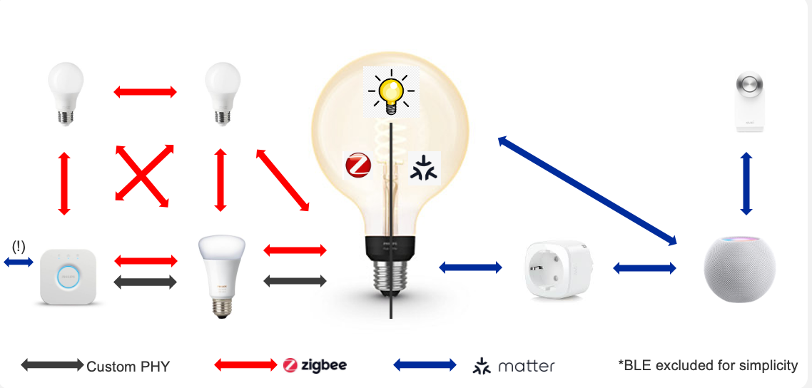

# Matter Zigbee Lighting Example

An example showing the use of Matter alongside Zigbee on the Silicon Labs MG24/MG26.

<hr>

-   [Matter Zigbee Lighting Example](#matter-Zigbee-lighting-example)
    -   [Introduction](#introduction)
    -   [Building](#building)
        -   [Prerequisite](#prerequisite)
        -   [Setuping up the repo](#setuping-up-the-repo)
        -   [Building command](#building-command)
    -   [Expected Behaviour](#expected-behaviour)
    -   [Customizing](#customizing)
        -   [Matter](#matter)
        -   [Zigbee](#Zigbee)
        -   [DataModel](#datamodel)

<hr>

# Introduction

This sample App demonstrate the usage of the Matter Stack alongside the Silicon Labs Zigbee stack. As such the lighting device represented by a MG24/MG26 is able to receives On/Off commands from both a Zigbee switch ([Z3 switch](https://www.silabs.com/support/training/Zigbee-application-layer-concepts/building-a-Zigbee-3-0-switch-and-light-from-scratch) sample app) and a Matter controller (Google, Apple, Chip-tool) as represented in the below diagram.



# Building

## Prerequisite

The following prerequisite needs to be installed on the host machine :

- ARM GCC 12.2
- ZAP (version 2024.05.07 or greatest)
- SLC-CLI
- Various env variable set like :
    - ARM_GCC_DIR
    - TOOLDIR
    - STUDIO_ADAPTER_PACK_PATH

# Build Variant

As of now this samples app support two different build variant 
- [Sequential Zigbee & Matter](#sequential-Zigbee--matter)
- [Concurrent Zigbee & Matter](#concurrent-Zigbee--matter)

## Sequential Zigbee & Matter
In this scenario the node will act as a plain Zigbee device with the full set of Zigbee feature working properly such as Touchlink.

## Concurrent Zigbee & Matter
In this scenario the node will act both as a Zigbee device and a Matter device capable of receiving commands from both protocol at the same time.

# Known limitations
- CLI & Logs output are defaulted to the uart interface. Instead of having logs on RTTViewer and CLI/ Matter shell on the UART, everything is forwarded to the uart to prevent weird routing of log messages and uart commands. Issue is present with SISDK 2024.6.0
- Single Channel listening : Probably the biggest limitation for this examples in concurrent mode. With SISDK 2024.6.0 the radio mux only support a single channel for listening. This mean that when the device is commissioned on the Matter network it needs to switch channel to match the one used by the OTBR. Since the OTBR can be a fully closed product like a Google Nest Hub, an Apple TV, an Amazon echo etc... there is absolutely no control over which channel is going to be selected. As such other steering channel feature like Touchlink are incompatible with this sample app because of this limitation in concurrent mode.

# Expected Behaviour

Once the application is build and flashed onto the device, you should see the Matter QR code displayed and if you're using a BLE sniffer like the EFRConnect app you should be able to see the Silabs-Light being advertised and ready to be commissioned into a Matter network.

## Sequential Zigbee & Matter
With this build variant your device will act as a Zigbee device as long as no Matter fabric are present on the device. Once the device is successfully commissioned with Matter the Zigbee network will be shutdown forever (or until the next factory reset).

Features like touchlink will work just fine with this build variant since there is no need to listen on multiple channel at once.

## Concurrent Zigbee & Matter

With this build variant, the light can be controlled simultaneously from the Matter side or the Zigbee side. For the best user experience, it is advised to commission the Matter side **FIRST** as the OTBR will trigger a channel switch on the Zigbee side. Should Zigbee be commissioned first, then upon completion of the Matter commissionning process a network leave followed by a network start will be issued to the Zigbee stack in order to achieve a successful channel switch without missing any packets from the Matter side. As such all previously paired device on the Zigbee side will have to be re-paired with the device. Again this is a limitation caused by SiSDK 2024.6.0. This should be fixed with in the future versions of SiSDK.

## Building command
From the root of the Extension repo
```
./slc/build.sh slc/sample-app/zigbee-matter-light/efr32/zigbee-matter-light.slcp brd4187c,matter_zigbee_sequential\;matter

./slc/build.sh slc/sample-app/zigbee-matter-light/efr32/zigbee-matter-light.slcp brd4187c,matter_zigbee_concurrent\;matter
```

Building it without any extra component will default to the concurrent version
```
./slc/build.sh slc/sample-app/zigbee-matter-light/efr32/zigbee-matter-light.slcp brd4187c
```

# Customizing 
This sample app can be customized to fit most of your need. Here is how : 
## Matter
Just like any other Matter sample app you can add and remove the Matter extension components that you need.
## Zigbee
Just like any other Zigbee sample app you can add and remove the Matter extension components that you need.
However if you want to support install code, you need to actually modify the configuration file present within this project to set `SL_MATTER_CMP_SECURE_ZIGBEE` to 1. This will disable TouchLink and use the provided install code and EUID64 present in the same configuration file (`sl_cmp_config.h`)
## DataModel
Since Matter and Zigbee data model are quite similar this project only needs a single zap file for both protocol. For the best user experience it is recommended that the endpoint configuration match as close as possible on the two protocols (except for endpoint 0 which is protocol specific)
